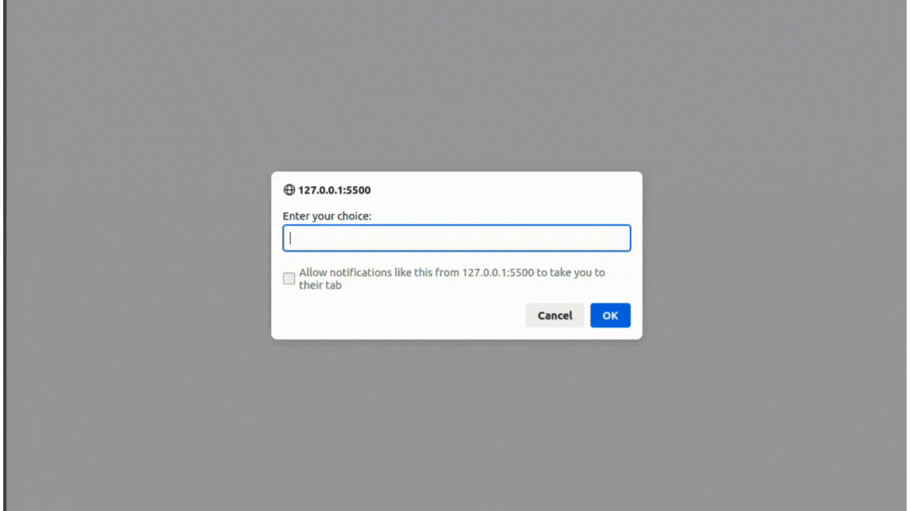

# Rock_Paper_Scissors

It's a simple game of "Rock, Paper And Scissors" using JavaScript and DOM manipulation.

**Link to project:** https://defalterxd.github.io/Rock_Paper_Scissors/

## How It's Made:

**Tech used:** HTML, CSS, JavaScript

In the beginning, I had to make the ui itself so that there would be something for the user to interact with. So UI consist of:
<ul>
  <li>Buttons to pick</li>
  <li>Score count</li>
  <li>Match result</li>
</ul>

Then in JavaScript I had to collect all the necessary elements from the DOM in order to:

<ul>
  <li>Display who won</li>
  <li>Display the current score</li> 
  <li>Display the winning inscription of one of the parties (while removing the buttons for interaction so that the score was capped up to 5)</li>
  
</ul>

## Lesson Learned:

In this project, I was able to make a new branch and using it from a 'trunk' aka main.  
Building a new UI for a 'gameplay'.  
Being more comfortable with DOM manipulation and eventListeners and using unfamiliar array methods.

## Reference:
**Site used for icons:** https://www.flaticon.com/

<ol>
<h4>Authors:</h4>
<li> Cuputo - 'Rock'</li>
<li> iconading - 'Paper'</li>
<li>Cap Cool - 'Scissors'</li>
</ol>

**Site for color pallete:** https://realtimecolors.com
