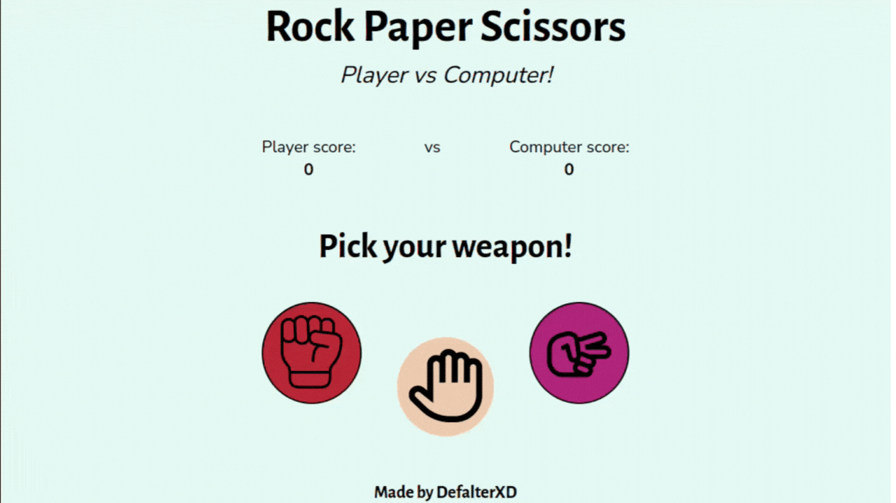

# Rock_Paper_Scissors

It's a simple game project to be more familiar with JavaScript events.

**Link to project:** https://defalterxd.github.io/Rock_Paper_Scissors/

## How It's Made:

**Tech used:** HTML, CSS, JavaScript

First, I had to make the ui itself so that there would be something for the user to interact with.
Then in javascript I had to collect all the necessary elements from the DOM in order to: 
Display who won, display the current score and the winning inscription of one of the parties (while removing the buttons for interaction so that the score was capped up to 5)

## Lesson Learned:

In this project, I was able to make a new branch from a 'trunk' aka main. Being more comfortable with events in javascript and using new array methods.

## Reference:
**Site used for icons:** https://www.flaticon.com/

<ol>
<h2>Authors:</h2>
<li> Cuputo - rock</li>
<li> iconading - paper</li>
<li>Cap Cool - scissors</li>
</ol>